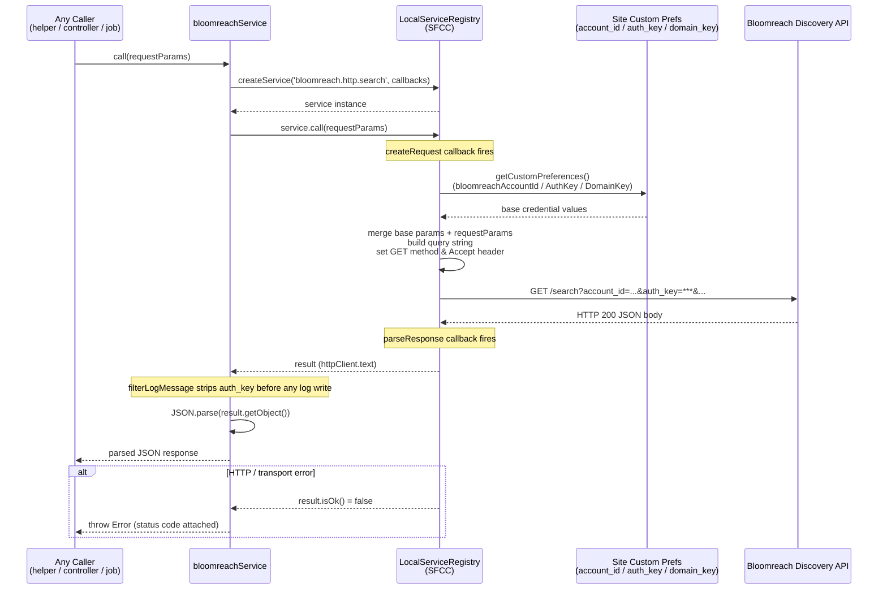
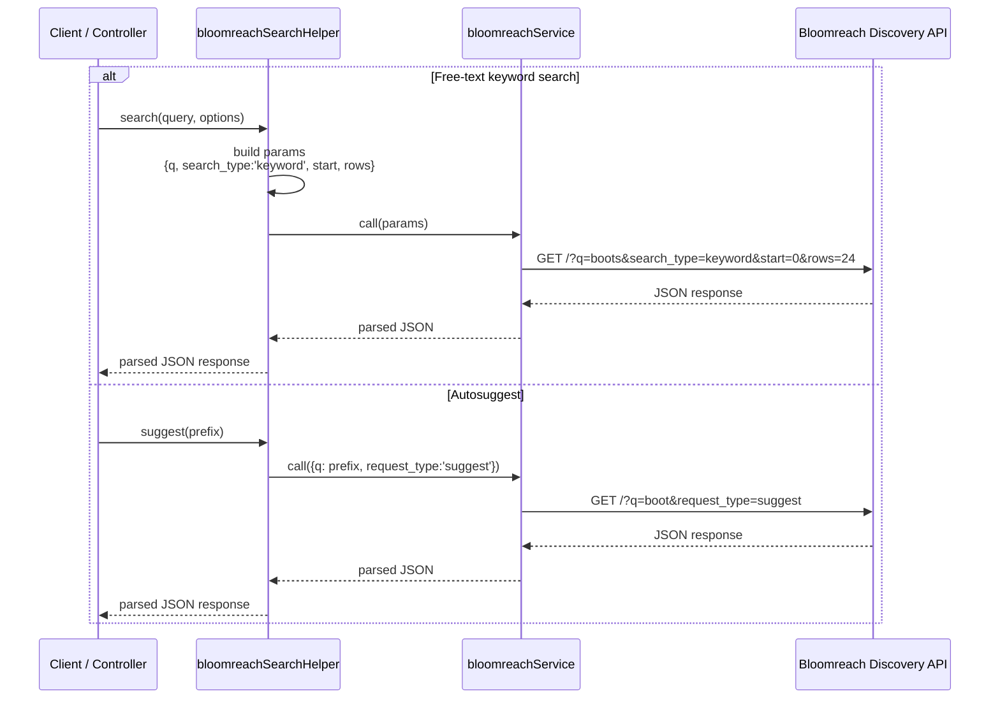
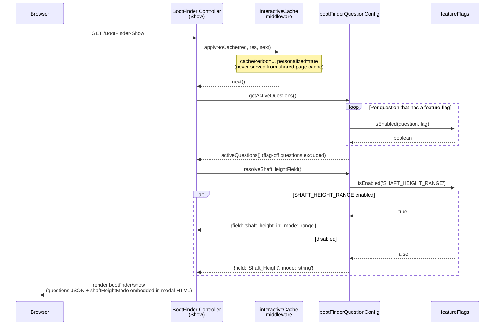
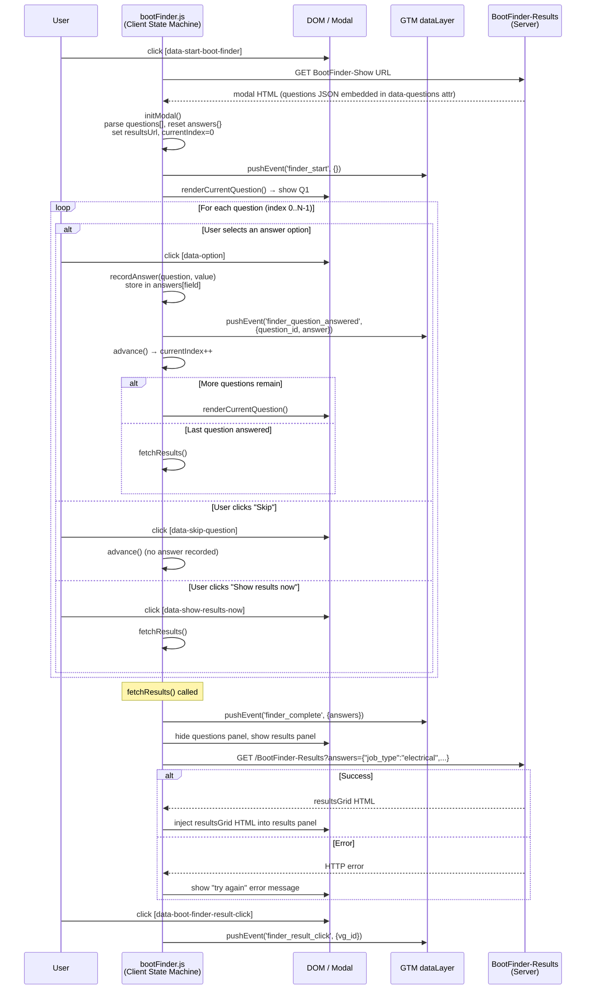
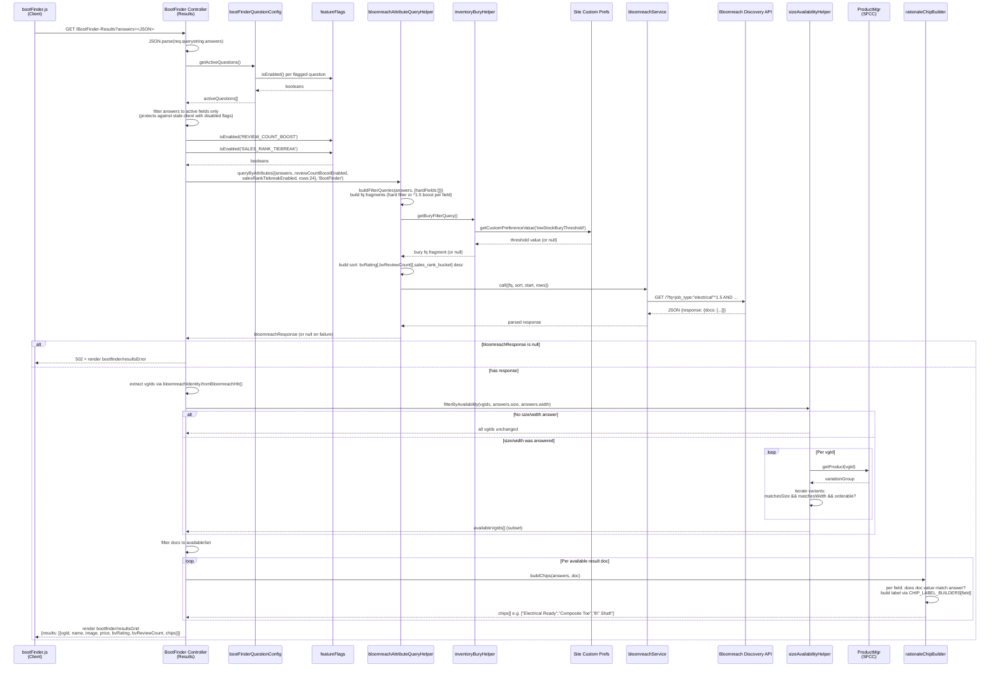
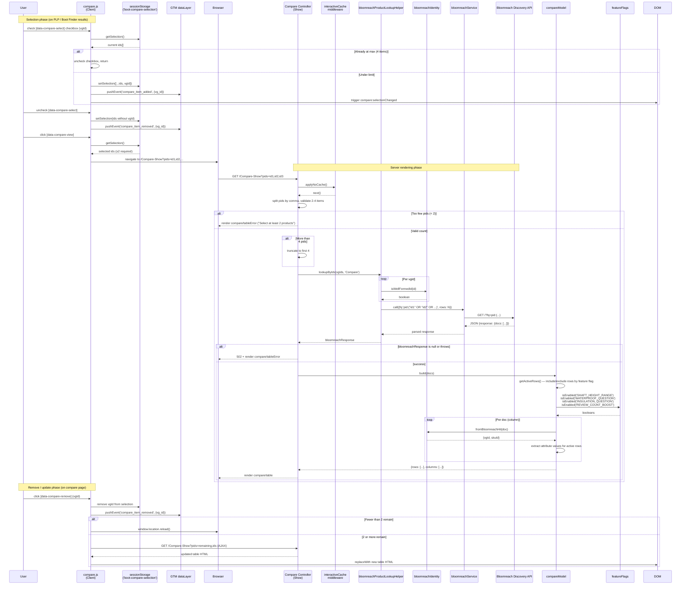
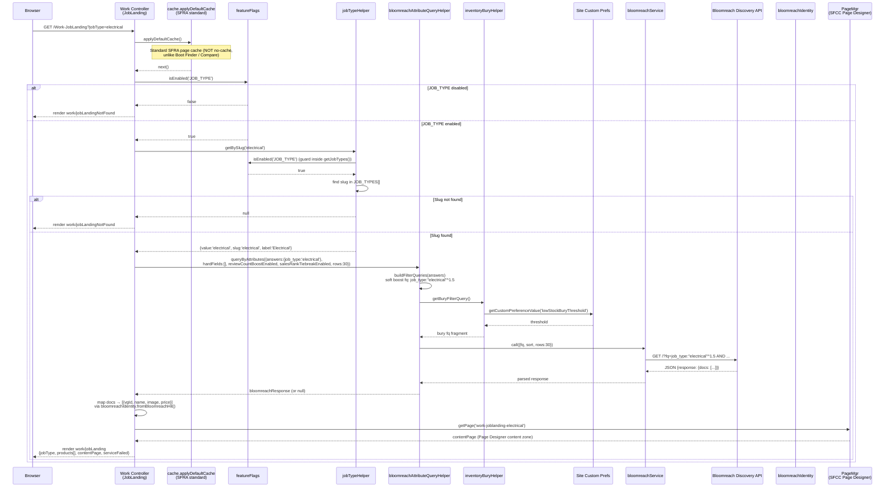
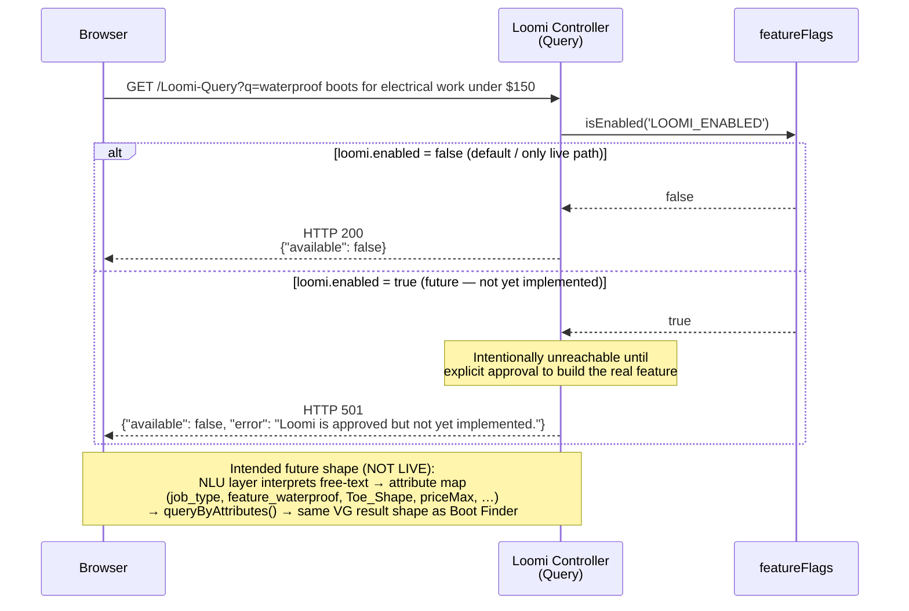
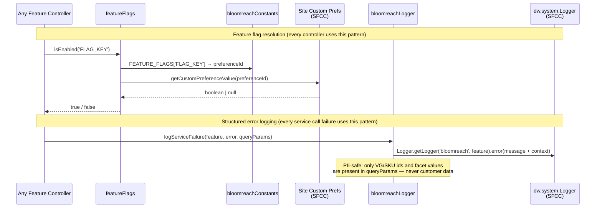

# Bloomreach SFRA – Sequence Diagrams

All sequence diagrams use [Mermaid](https://mermaid.js.org/) syntax and can be rendered
directly in GitHub, GitLab, VS Code (Mermaid extension), or any Mermaid-aware viewer.

---

## 1. Bloomreach Service Layer (Base HTTP Call)

Every feature in this integration (Boot Finder, Comparison Tool, Work Job Landing,
Thematic Pages, and free-text search/suggest) routes through this single service
module rather than making raw HTTP calls.



---

## 2. Free-Text Search & Autosuggest

Standard keyword search and autocomplete calls used by the existing site search
integration (these shapes are the baseline that all new filter-query (`fq`)-based features extend).



---

## 3. Boot Finder – Initial Page Load (Show)

Renders the modal shell with the active question list embedded as JSON so the
client-side state machine can drive all subsequent steps without extra round trips.



---

## 4. Boot Finder – Client-Side Question State Machine

After the modal HTML is loaded, the browser drives the entire question flow locally
using the embedded question list. No server round trip occurs until the shopper is
ready to see results.



---

## 5. Boot Finder – Results (Server-Side AJAX Endpoint)

Handles the AJAX call made by the client state machine once the shopper has answered
(or skipped) all active questions.



---

## 6. Comparison Tool

Covers both the client-side selection management and the server-side table rendering.



---

## 7. Work / Job Landing Page

Attribute-filtered browse page for a trade job type (e.g. `/Work-JobLanding?jobType=electrical`).
Uses the same query-building helper as Boot Finder Question 1 (job-type selection) and supports standard SFRA page caching.



---

## 8. Loomi Conversational Search (Feature-Flagged Stub)

Loomi is license-gated and not yet approved for build. This controller is a documented
stub only — the only live code path returns `{"available": false}`.



---

## 9. Generate Thematic Pages (Batch Job)

SFCC Job step that reads a merchandiser-editable combination matrix, queries Bloomreach
per row, and creates/updates/hides Content assets with schema.org JSON-LD markup.
Runs immediately before the existing "Generate Sitemap" job step.

```mermaid
sequenceDiagram
    participant SFCCJob as SFCC Job Framework
    participant GenerateTP as GenerateThematicPages<br/>(execute)
    participant CustomObjMgr as CustomObjectMgr<br/>(SFCC)
    participant featureFlags as featureFlags
    participant attrQueryHelper as bloomreachAttributeQueryHelper
    participant inventoryBury as inventoryBuryHelper
    participant bloomreachService as bloomreachService
    participant BloomreachAPI as Bloomreach Discovery API
    participant identity as bloomreachIdentity
    participant Transaction as Transaction<br/>(SFCC)
    participant ContentMgr as ContentMgr<br/>(SFCC)

    SFCCJob->>GenerateTP: execute({DryRun: true|false})

    GenerateTP->>CustomObjMgr: getAllCustomObjects('ThematicPageCombination')
    CustomObjMgr-->>GenerateTP: iterator of enabled combinations

    loop Per enabled ThematicPageCombination
        GenerateTP->>GenerateTP: isEligible(combo)
        alt combo has safetySpec AND SAFETY_SPEC_REFINEMENT flag is off (upstream feed fix pending — skip to avoid stale/corrupted pages)
            GenerateTP->>featureFlags: isEnabled('SAFETY_SPEC_REFINEMENT')
            featureFlags-->>GenerateTP: false
            GenerateTP->>GenerateTP: log warn, skip combination
        else eligible
            GenerateTP->>GenerateTP: buildAnswers(combo)<br/>{job_type, toe_shape?, safety_specs?}

            GenerateTP->>attrQueryHelper: queryByAttributes({answers, hardFields:[JOB_TYPE,TOE_SHAPE,SAFETY_SPECS], rows:48})
            attrQueryHelper->>attrQueryHelper: buildFilterQueries(answers, {hardFields})<br/>hard fq filters (no boost weight) per field
            attrQueryHelper->>inventoryBury: getBuryFilterQuery()
            inventoryBury-->>attrQueryHelper: bury fq fragment
            attrQueryHelper->>bloomreachService: call({fq, sort, rows:48})
            bloomreachService->>BloomreachAPI: GET /?fq=job_type:"electrical" AND toe_shape:"Composite" AND ...
            BloomreachAPI-->>bloomreachService: JSON {response: {docs: [...]}}
            bloomreachService-->>attrQueryHelper: parsed response
            attrQueryHelper-->>GenerateTP: bloomreachResponse (or null)

            alt bloomreachResponse null (service failure)
                GenerateTP->>GenerateTP: errors++ , continue to next combination
            else success
                GenerateTP->>identity: fromBloomreachHit(doc) per doc
                identity-->>GenerateTP: {vgId, skuId} per doc
                GenerateTP->>GenerateTP: buildSchemaOrgMarkup(combo, docs)<br/>→ schema.org ItemList JSON-LD

                alt DryRun = true
                    GenerateTP->>GenerateTP: log "[DryRun] would set online=<bool>, N products"
                    Note over GenerateTP: No write to ContentMgr
                else DryRun = false
                    GenerateTP->>Transaction: wrap()
                    Transaction->>ContentMgr: getContent('work-electrical-composite-...')
                    alt Content asset does not exist
                        ContentMgr-->>Transaction: null
                        Transaction->>ContentMgr: createContent(contentId)
                        Transaction->>ContentMgr: folder('work-thematic-pages').assignContent(content)
                    else exists
                        ContentMgr-->>Transaction: content
                    end
                    Transaction->>Transaction: content.setOnline(docs.length > 0)<br/>(offline = no in-stock products; protects SEO)
                    alt has products
                        Transaction->>Transaction: content.custom.body = schemaOrgJSON<br/>content.custom.productCount = N
                    end
                    Transaction-->>GenerateTP: committed
                end
                GenerateTP->>GenerateTP: processed++
            end
        end
    end

    GenerateTP->>GenerateTP: log summary (processed, errors, dryRun)
    alt errors > 0 AND processed == 0
        GenerateTP-->>SFCCJob: Status.ERROR ("All combinations failed")
    else
        GenerateTP-->>SFCCJob: Status.OK ("N combinations processed, M errors")
    end
```

---

## Cross-Cutting Relationships


