# Bloomreach SFRA – Sequence Diagrams

All sequence diagrams use [Mermaid](https://mermaid.js.org/) syntax and can be rendered
directly in GitHub, GitLab, VS Code (Mermaid extension), or any Mermaid-aware viewer.

---

## 1. Bloomreach Service Layer (Base HTTP Call)

> **Business context:** This is the shared "phone line" that every Bloomreach-powered feature
> uses when it needs to fetch product data. Rather than each feature managing its own
> connection to Bloomreach, they all go through one central module that handles API
> credentials, request formatting, and error logging automatically. This means credential
> changes or logging improvements only need to be made in one place, and sensitive API
> keys are never written to logs.

Every feature in this integration (Boot Finder, Comparison Tool, Work Job Landing,
Thematic Pages, and free-text search/suggest) routes through this single service
module rather than making raw HTTP calls.

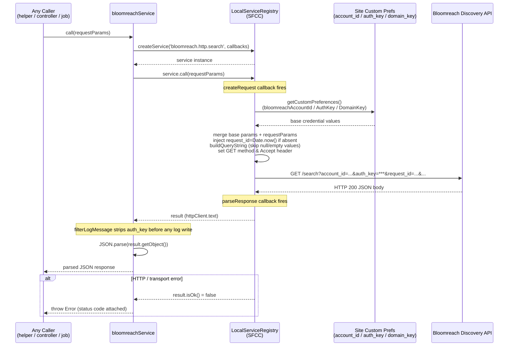

---

## 2. Free-Text Search & Autosuggest

> **Business context:** This covers what happens when a shopper types keywords into the
> site search bar. There are two sub-flows: **search** (returning a full results page for a
> submitted query such as "waterproof boots") and **autosuggest** (returning instant
> suggestions as the shopper types). Both call Bloomreach's Discovery API and are the
> foundation on which all the more specialised attribute-filter features (Boot Finder,
> Job Landing, Thematic Pages) are built.

Standard keyword search and autocomplete calls used by the existing site search
integration (these shapes are the baseline that all new filter-query (`fq`)-based features extend).

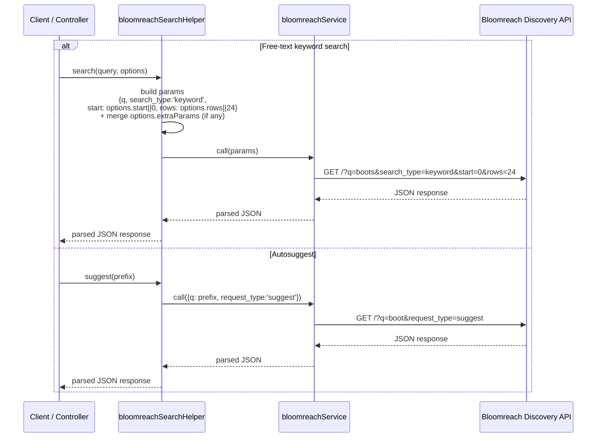

---

## 3. Boot Finder – Initial Page Load (Show)

> **Business context:** This is what happens the moment a shopper opens the Boot Finder
> modal. The server checks which questions are currently switched on (via feature flags
> controlled in SFCC Business Manager) and sends the complete question set to the browser
> in a single response. From that point on, the questionnaire runs entirely in the
> browser — there are no loading delays between questions — which keeps the guided
> experience fast and seamless for the shopper.

Renders the modal shell with the active question list embedded as JSON so the
client-side state machine can drive all subsequent steps without extra round trips.

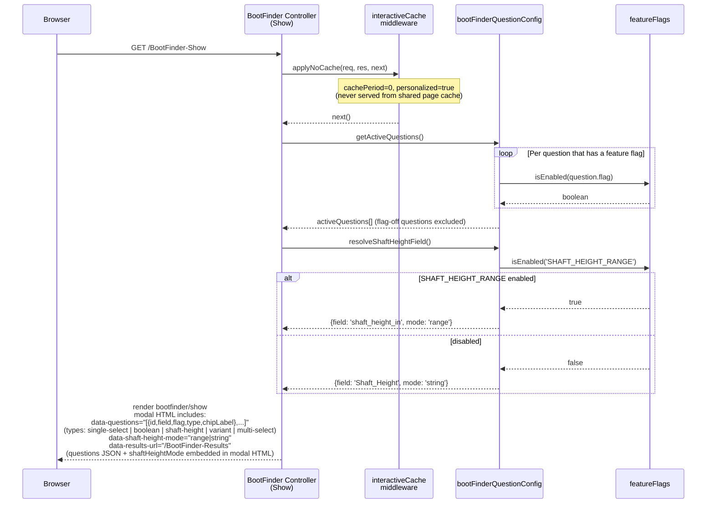

---

## 4. Boot Finder – Client-Side Question State Machine

> **Business context:** This tracks the shopper's complete journey through the Boot Finder
> questionnaire — from dismissing the entry card, to answering each question (job type,
> toe shape, shaft height, waterproofing, insulation, size/width), to skipping a question,
> to tapping "Show results now" early. Every answer is stored locally in the browser, and
> analytics events are fired to GTM at each step. Only one server call is made — when the
> shopper is finally ready to see their personalised product recommendations.

After the modal HTML is loaded, the browser drives the entire question flow locally
using the embedded question list. No server round trip occurs until the shopper is
ready to see results.

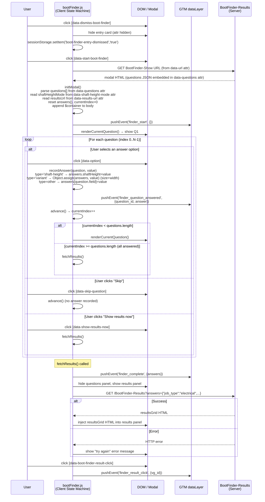

---

## 5. Boot Finder – Results (Server-Side AJAX Endpoint)

> **Business context:** Once the shopper has answered (or skipped) all Boot Finder
> questions, this endpoint converts those answers into a personalised product grid.
> The server queries Bloomreach using the shopper's choices as filters, then cross-checks
> SFCC inventory to ensure only boots available in the shopper's chosen size and width are
> shown. Each result card is decorated with plain-language "match chips" (e.g.
> "Electrical Ready", "Composite Toe", "8″ Shaft") that tell the shopper exactly why that
> boot was recommended for them.

Handles the AJAX call made by the client state machine once the shopper has answered
(or skipped) all active questions.

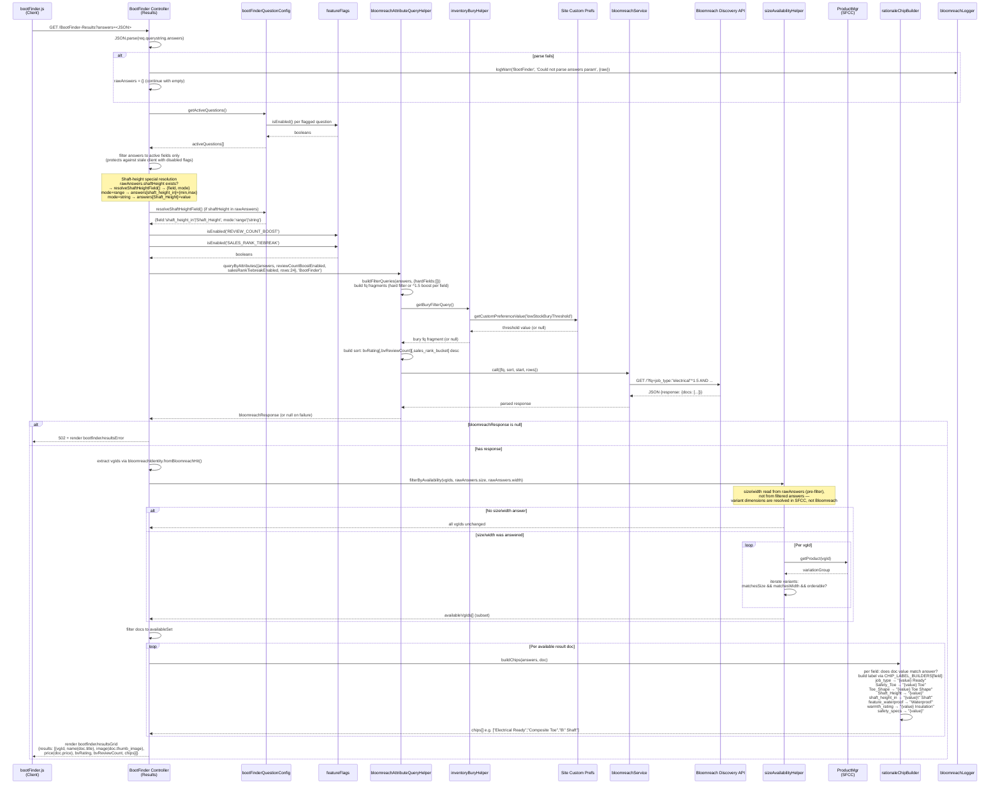

---

## 6. Comparison Tool

> **Business context:** Lets shoppers select up to four boots from any listing page (PLP,
> Boot Finder results, Job Landing page) and view them in a side-by-side feature
> comparison table. Selections persist in session storage as the shopper browses, so
> they can add products from multiple pages before hitting "Compare". The table rows
> (Safety Toe, Toe Shape, Shaft Height, Waterproof, Insulation, Ratings) are driven by
> the same feature flags as Boot Finder, so the comparison table always stays in sync
> with whichever product attributes are currently enabled on the site.

Covers both the client-side selection management and the server-side table rendering.

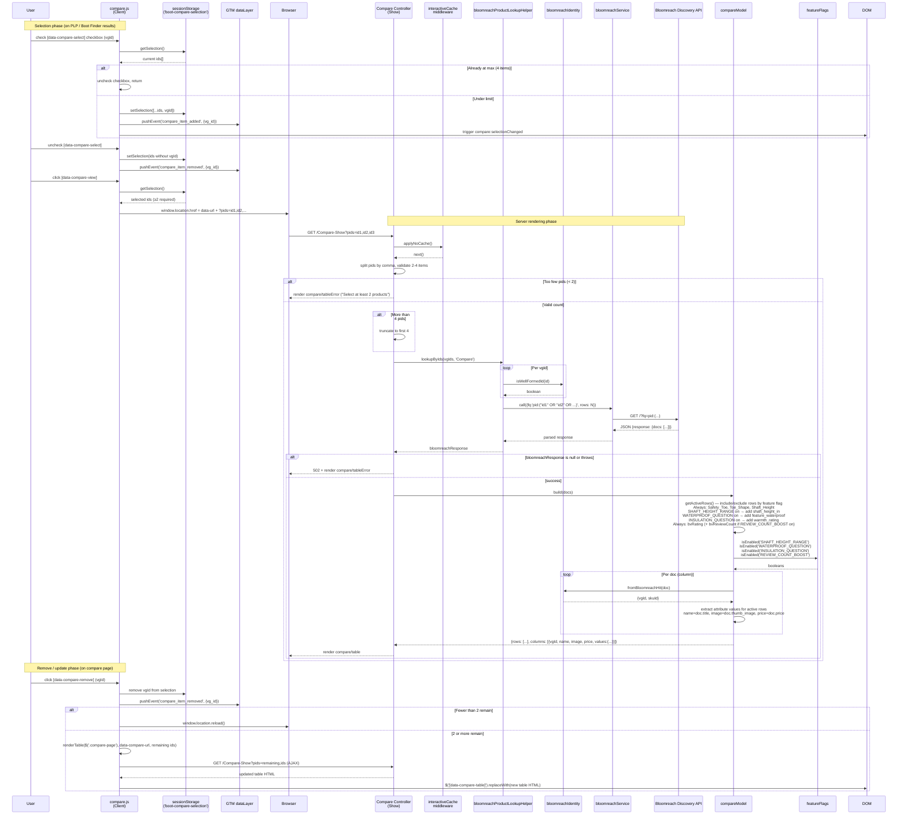

---

## 7. Work / Job Landing Page

> **Business context:** Generates a trade-specific browse page — for example,
> `/Work-JobLanding?jobType=electrical` shows "Boots for Electrical Work" — surfacing the
> highest-rated products that match a particular job category. Unlike Boot Finder, the
> shopper doesn't answer any questions; the job type is determined by the URL, which
> makes these pages fully cacheable and SEO-indexable. Merchandisers enable or disable
> individual job-type pages through a feature flag in Business Manager, and Page Designer
> content zones let them add editorial copy above the product grid.

Attribute-filtered browse page for a trade job type (e.g. `/Work-JobLanding?jobType=electrical`).
Uses the same query-building helper as Boot Finder Question 1 (job-type selection) and supports standard SFRA page caching.

...mermaid
---
config:
  layout: elk
---
sequenceDiagram
    participant SFCCJob as SFCC Job Framework
    participant GenerateTP as GenerateThematicPages<br/>(execute)
    participant CustomObjMgr as CustomObjectMgr<br/>(SFCC)
    participant featureFlags as featureFlags
    participant attrQueryHelper as bloomreachAttributeQueryHelper
    participant inventoryBury as inventoryBuryHelper
    participant bloomreachService as bloomreachService
    participant BloomreachAPI as Bloomreach Discovery API
    participant identity as bloomreachIdentity
    participant Transaction as Transaction<br/>(SFCC)
    participant ContentMgr as ContentMgr<br/>(SFCC)

    SFCCJob->>GenerateTP: execute({DryRun: true|false})

    GenerateTP->>CustomObjMgr: getAllCustomObjects("ThematicPageCombination")
    CustomObjMgr-->>GenerateTP: iterator of enabled combinations

    loop Per enabled ThematicPageCombination
        GenerateTP->>GenerateTP: isEligible(combo)
        alt combo has safetySpec AND SAFETY_SPEC_REFINEMENT flag is off (upstream feed fix pending — skip to avoid stale/corrupted pages)
            GenerateTP->>featureFlags: isEnabled("SAFETY_SPEC_REFINEMENT")
            featureFlags-->>GenerateTP: false
            GenerateTP->>GenerateTP: log warn, skip combination
        else eligible
            GenerateTP->>GenerateTP: buildAnswers(combo)<br/>{job_type, toe_shape?, safety_specs?}

            GenerateTP->>attrQueryHelper: queryByAttributes({answers, hardFields:[JOB_TYPE,TOE_SHAPE,SAFETY_SPECS], rows:48})
            attrQueryHelper->>attrQueryHelper: buildFilterQueries(answers, {hardFields})<br/>hard fq filters (no boost weight) per field
            attrQueryHelper->>inventoryBury: getBuryFilterQuery()
            inventoryBury-->>attrQueryHelper: bury fq fragment
            attrQueryHelper->>bloomreachService: call({fq, sort, rows:48})
            bloomreachService->>BloomreachAPI: GET /?fq=job_type:"electrical" AND toe_shape:"Composite" AND ...
            BloomreachAPI-->>bloomreachService: JSON {response: {docs: [...]}}
            bloomreachService-->>attrQueryHelper: parsed response
            attrQueryHelper-->>GenerateTP: bloomreachResponse (or null)

            alt bloomreachResponse null (service failure)
                GenerateTP->>GenerateTP: errors++ , continue to next combination
            else success
                GenerateTP->>identity: fromBloomreachHit(doc) per doc
                identity-->>GenerateTP: {vgId, skuId} per doc
                GenerateTP->>GenerateTP: buildSchemaOrgMarkup(combo, docs)<br/>→ schema.org ItemList JSON-LD

                alt DryRun = true
                    GenerateTP->>GenerateTP: log "[DryRun] would set online=<bool>, N products"
                    Note over GenerateTP: No write to ContentMgr
                else DryRun = false
                    GenerateTP->>Transaction: wrap()
                    Transaction->>ContentMgr: getContent("work-electrical-composite-...")
                    alt Content asset does not exist
                        ContentMgr-->>Transaction: null
                        Transaction->>ContentMgr: getFolder("work-thematic-pages")
                        alt folder is null
                            ContentMgr-->>Transaction: null
                            Transaction->>Transaction: log.error("folder does not exist — skip")
                        else folder found
                            ContentMgr-->>Transaction: folder
                            Transaction->>ContentMgr: createContent(contentId)
                            Transaction->>ContentMgr: folder.assignContent(content)
                        end
                    else exists
                        ContentMgr-->>Transaction: content
                    end
                    Transaction->>Transaction: content.setOnline(docs.length > 0)<br/>(offline = no in-stock products&#59; protects SEO)
                    alt has products
                        Transaction->>Transaction: content.custom.body = schemaOrgJSON<br/>content.custom.productCount = docs.length
                    end
                    Transaction-->>GenerateTP: committed
                end
                GenerateTP->>GenerateTP: processed++
            end
        end

        alt exception thrown
            GenerateTP->>GenerateTP: errors++<br/>log.error("Failed processing combination {key}: {message}")
        end
    end

    GenerateTP->>GenerateTP: log summary (processed, errors, dryRun)
    alt errors > 0 AND processed == 0
        GenerateTP-->>SFCCJob: Status.ERROR ("All combinations failed")
    else
        GenerateTP-->>SFCCJob: Status.OK ("N combinations processed, M errors")
    end

## 8. Loomi Conversational Search (Feature-Flagged Stub)

> **Business context:** Loomi is Bloomreach's AI-powered natural-language search
> capability — it would allow shoppers to type requests like "waterproof boots for
> electrical work under $150" and receive intelligent, context-aware results. Because
> Loomi requires a separate commercial licence that has not yet been approved, this
> section documents the planned integration shape rather than live code. Currently the
> endpoint always responds with `{ "available": false }` so the rest of the site can
> be built and tested independently. When the licence is in place, this stub is the
> starting point for the real implementation.

Loomi is license-gated and not yet approved for build. This controller is a documented
stub only — the only live code path returns `{"available": false}`.

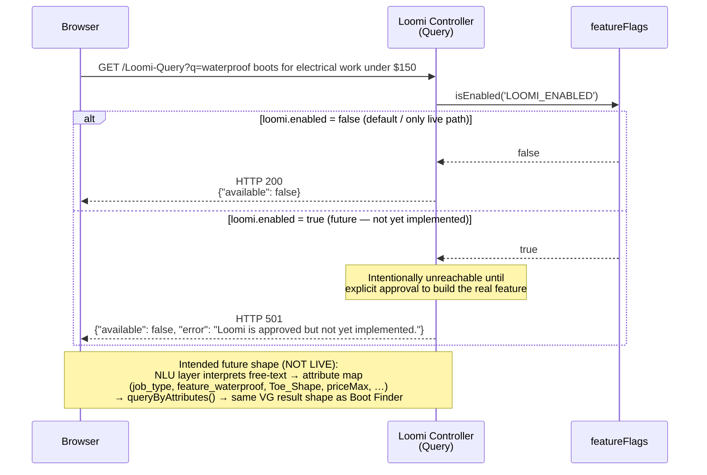

---

## 9. Generate Thematic Pages (Batch Job)

> **Business context:** An automated overnight job that creates and maintains SEO landing
> pages for specific product attribute combinations — for example, "Electrical Composite
> Toe Boots" or "Waterproof Wide-Width Work Boots". A merchandiser maintains a list of
> desired page combinations in a SFCC Custom Object; the job queries Bloomreach for each
> combination and either publishes the page (if matching in-stock products exist) or takes
> it offline (if no products match), ensuring shoppers and search engines never land on
> an empty page. A "dry run" mode lets teams preview what would be published before
> making any live changes.

SFCC Job step that reads a merchandiser-editable combination matrix, queries Bloomreach
per row, and creates/updates/hides Content assets with schema.org JSON-LD markup.
Runs immediately before the existing "Generate Sitemap" job step.

```mermaid
sequenceDiagram
    participant SFCCJob as SFCC Job Framework
    participant GenerateTP as GenerateThematicPages<br/>(execute)
    participant CustomObjMgr as CustomObjectMgr<br/>(SFCC)
    participant featureFlags as featureFlags
    participant attrQueryHelper as bloomreachAttributeQueryHelper
    participant inventoryBury as inventoryBuryHelper
    participant bloomreachService as bloomreachService
    participant BloomreachAPI as Bloomreach Discovery API
    participant identity as bloomreachIdentity
    participant Transaction as Transaction<br/>(SFCC)
    participant ContentMgr as ContentMgr<br/>(SFCC)

    SFCCJob->>GenerateTP: execute({DryRun: true|false})

    GenerateTP->>CustomObjMgr: getAllCustomObjects('ThematicPageCombination')
    CustomObjMgr-->>GenerateTP: iterator of enabled combinations

    loop Per enabled ThematicPageCombination
        GenerateTP->>GenerateTP: isEligible(combo)
        alt combo has safetySpec AND SAFETY_SPEC_REFINEMENT flag is off (upstream feed fix pending — skip to avoid stale/corrupted pages)
            GenerateTP->>featureFlags: isEnabled('SAFETY_SPEC_REFINEMENT')
            featureFlags-->>GenerateTP: false
            GenerateTP->>GenerateTP: log warn, skip combination
        else eligible
            GenerateTP->>GenerateTP: buildAnswers(combo)<br/>{job_type, toe_shape?, safety_specs?}

            GenerateTP->>attrQueryHelper: queryByAttributes({answers, hardFields:[JOB_TYPE,TOE_SHAPE,SAFETY_SPECS], rows:48})
            attrQueryHelper->>attrQueryHelper: buildFilterQueries(answers, {hardFields})<br/>hard fq filters (no boost weight) per field
            attrQueryHelper->>inventoryBury: getBuryFilterQuery()
            inventoryBury-->>attrQueryHelper: bury fq fragment
            attrQueryHelper->>bloomreachService: call({fq, sort, rows:48})
            bloomreachService->>BloomreachAPI: GET /?fq=job_type:"electrical" AND toe_shape:"Composite" AND ...
            BloomreachAPI-->>bloomreachService: JSON {response: {docs: [...]}}
            bloomreachService-->>attrQueryHelper: parsed response
            attrQueryHelper-->>GenerateTP: bloomreachResponse (or null)

            alt bloomreachResponse null (service failure)
                GenerateTP->>GenerateTP: errors++ , continue to next combination
            else success
                GenerateTP->>identity: fromBloomreachHit(doc) per doc
                identity-->>GenerateTP: {vgId, skuId} per doc
                GenerateTP->>GenerateTP: buildSchemaOrgMarkup(combo, docs)<br/>→ schema.org ItemList JSON-LD

                alt DryRun = true
                    GenerateTP->>GenerateTP: log "[DryRun] would set online=<bool>, N products"
                    Note over GenerateTP: No write to ContentMgr
                else DryRun = false
                    GenerateTP->>Transaction: wrap()
                    Transaction->>ContentMgr: getContent('work-electrical-composite-...')
                    alt Content asset does not exist
                        ContentMgr-->>Transaction: null
                        Transaction->>ContentMgr: getFolder('work-thematic-pages')
                        alt folder is null
                            ContentMgr-->>Transaction: null
                            Transaction->>Transaction: log.error('folder does not exist — skip')
                        else folder found
                            ContentMgr-->>Transaction: folder
                            Transaction->>ContentMgr: createContent(contentId)
                            Transaction->>ContentMgr: folder.assignContent(content)
                        end
                    else exists
                        ContentMgr-->>Transaction: content
                    end
                    Transaction->>Transaction: content.setOnline(docs.length > 0)<br/>(offline = no in-stock products; protects SEO)
                    alt has products
                        Transaction->>Transaction: content.custom.body = schemaOrgJSON<br/>content.custom.productCount = docs.length
                    end
                    Transaction-->>GenerateTP: committed
                end
                GenerateTP->>GenerateTP: processed++
            end
        end

        alt exception thrown
            GenerateTP->>GenerateTP: errors++<br/>log.error('Failed processing combination {key}: {message}')
        end
    end

    GenerateTP->>GenerateTP: log summary (processed, errors, dryRun)
    alt errors > 0 AND processed == 0
        GenerateTP-->>SFCCJob: Status.ERROR ("All combinations failed")
    else
        GenerateTP-->>SFCCJob: Status.OK ("N combinations processed, M errors")
    end
```

---

## Cross-Cutting Relationships

> **Business context:** Three patterns that are used consistently by every feature in
> this integration. **Feature flag resolution** shows how each capability (shaft-height
> range, waterproof question, review-count boost, etc.) is switched on or off through a
> simple checkbox in SFCC Business Manager — no code deployment required. **Structured
> logging** shows how errors are captured in a privacy-safe way (product IDs and facet
> values only — never customer data). **Identity enforcement** shows how the system
> guarantees that only the correct type of product ID (Variation Group or individual
> SKU) is ever sent to or received from Bloomreach, preventing a whole class of
> catalogue data bugs.

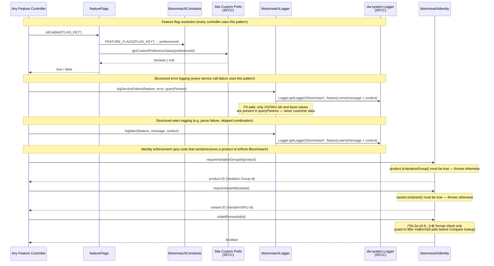

---

## 11. Attribute & Constants Reference

> **Business context:** A quick-reference guide for anyone who needs to understand which
> product attributes are used across Boot Finder, Compare, and Thematic Pages, and how
> each feature flag maps to a checkbox in SFCC Business Manager. The four sub-diagrams
> cover: (a) the product ID fields used to identify items in Bloomreach; (b) all
> searchable attribute names (safety toe, toe shape, shaft height, job type, waterproofing,
> warmth rating, ratings, and sales rank); (c) every feature flag and the exact Site
> Preference name a merchandiser would look for in Business Manager; and (d) how the
> product sort order (best-rated first, with optional tiebreakers) is assembled from
> those flags.

All logical attribute names, Bloomreach index field names, feature flags, and their preference IDs in one place.
These constants live in `bloomreachConstants.js` and are the single source of truth consumed by every helper and controller above.

### 11a. Identity Fields

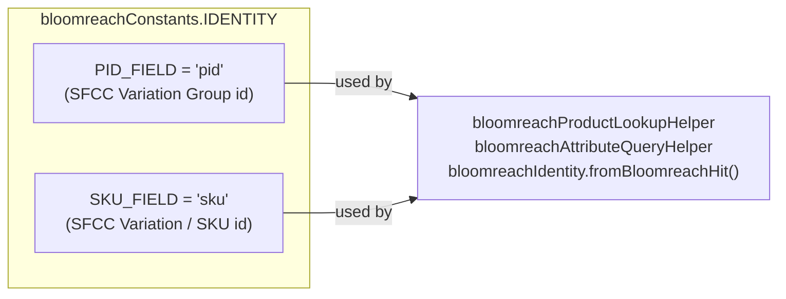

### 11b. Attribute Field Names

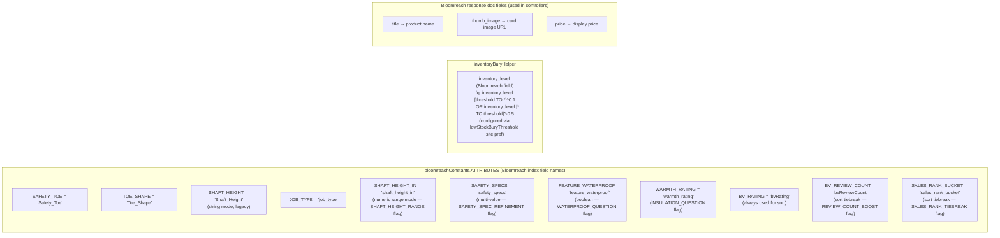

### 11c. Feature Flag → Site Preference ID Mapping

```mermaid
flowchart LR
    subgraph FLAGS["bloomreachConstants.FEATURE_FLAGS"]
        direction TB
        F1["JOB_TYPE → 'finderJobTypeEnabled'"]
        F2["SHAFT_HEIGHT_RANGE → 'finderShaftHeightRangeEnabled'"]
        F3["SAFETY_SPEC_REFINEMENT → 'finderSafetySpecRefinementEnabled'"]
        F4["WATERPROOF_QUESTION → 'finderWaterproofQuestionEnabled'"]
        F5["INSULATION_QUESTION → 'finderInsulationQuestionEnabled'"]
        F6["REVIEW_COUNT_BOOST → 'finderReviewCountBoostEnabled'"]
        F7["SALES_RANK_TIEBREAK → 'finderSalesRankTiebreakEnabled'"]
        F8["LOOMI_ENABLED → 'loomiEnabled'"]
    end
    FLAGS -->|"resolved by"| FH["featureFlags.isEnabled(flagKey)\nSite.getCurrent().getCustomPreferenceValue(prefId)"]
    FH -->|"consumed by"| C["BootFinder · Compare · Work\nbootFinderQuestionConfig · compareModel\nGenerateThematicPages · Loomi"]
```

### 11d. Sort Behaviour (attribute queries)

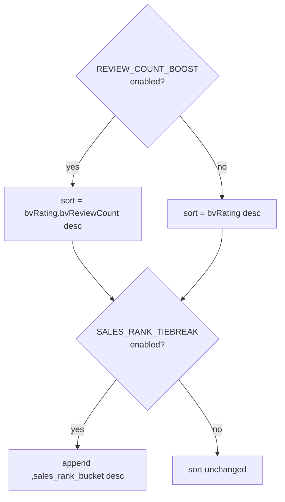
